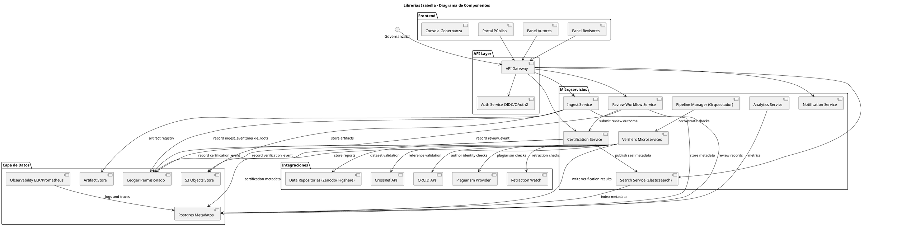
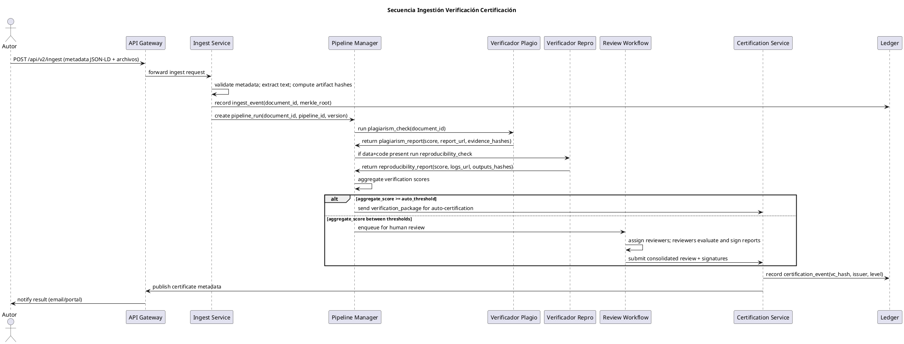

# 01 — Blueprint Arquitectónico (Verificación y Certificación de Integridad Científica)

> **Estado:** Vigente (PLAN) — **Propietario:** Arquitectura — **Revisión:** 2026-10-07

## 1. Principios de diseño

1. **Seguridad por diseño:** menor privilegio, cifrado extremo a extremo para datos sensibles, separación de entornos (dev/test/prod).
2. **Trazabilidad completa:** cada dato y acción auditada; ledger inmutable para registros críticos.
3. **Modularidad y extensibilidad:** microservicios desacoplados con APIs versionadas; verificadores y modelos añadibles sin reescribir la plataforma.
4. **Reproducibilidad:** cada verificación re-ejecutable con los mismos inputs y la misma salida; versionado de modelos y pipelines.
5. **Transparencia controlada:** metadatos y resultados accesibles según permisos; evidencia disponible para auditores.
6. **Integridad verificable:** cada artefacto (documento, dataset, código, imagen) con huella SHA-256 y registro inmutable de eventos.
7. **Gobernanza multi-stakeholder:** consejo asesor con investigadores, editores, auditores y representantes legales.

## 2. Capas y componentes

### 2.1 Capa de presentación (Frontend)
- SPA (React) con paneles para autores, revisores, auditores, administradores y público.
- Portal público de búsqueda y visualización de certificados y sellos.
- Consola de auditoría para equipos de gobernanza.

### 2.2 API Gateway y autenticación
- **API Gateway** (Kong/Envoy/NGINX): enrutamiento, rate limiting, WAF básico, logging de acceso.
- **Autenticación y autorización centralizada:** OAuth2/OIDC; integración ORCID para identidad académica; SSO (SAML).
- JWT con claims extendidos (`sub`, `orcid`, `roles`, `affiliation`, `scope`, `iat`, `exp`); refresh tokens con rotación y revocación.
- **RBAC/ABAC** con políticas finas (p. ej. revisor con `affiliation != document.affiliation` y sin COI).

### 2.3 Microservicios

| Servicio | Responsabilidad |
| --- | --- |
| **Ingest Service** | Valida JSON-LD (schema DataCite/Dublin Core ext.), extrae texto (PDF + OCR), genera Merkle root, almacena en S3. |
| **Indexación** | Normaliza y envía al motor de búsqueda con mapeos para metadatos, entidades y relaciones. |
| **Pipeline Manager** | Orquesta pipelines (Argo Workflows / Airflow) versionados; ejecuta verificadores en paralelo/secuencia. |
| **Verificadores** | Plagio/similitud, referencias/DOI, imágenes forenses, reproducibilidad, estadística, NLP de afirmaciones. |
| **Verificación humana (Workflow)** | Asigna revisores por especialidad, colas, evidencias, decisiones firmadas. |
| **Evidencia y ledger** | Registra eventos críticos e inmuta; almacena hashes y firmas. |
| **Certificación** | Genera sellos digitales, metadatos y Verifiable Credentials. |
| **Gobernanza y auditoría** | Paneles de KPIs, logs, métricas de calidad y gestión de políticas. |
| **Notificaciones y alertas** | Notifica a autores, revisores y administradores. |
| **Datos y analítica** | Métricas, reportes y dashboards (Grafana/Metabase). |

### 2.4 Capa de datos
- **Objeto:** S3-compatible (PDFs, datasets, imágenes, artefactos).
- **Metadatos:** PostgreSQL con esquema normalizado (versiones, relaciones, estados).
- **Búsqueda:** Elasticsearch/OpenSearch (scoring y facetas).
- **Ledger:** Hyperledger Fabric (consorcio multi-institucional) o Amazon QLDB (centralizado con integridad).
- **Logs/observabilidad:** ELK o equivalente.

### 2.5 Integraciones externas
CrossRef, ORCID, PubMed, Retraction Watch, DOI registries, servicios de plagio (iThenticate u otros), fact-checking,
Zenodo/Figshare, harvesters OAI-PMH y APIs.

### 2.6 Seguridad y cumplimiento
KMS para gestión de claves, HSM para firmas críticas, SIEM, políticas de retención y borrado.

## 3. Diagrama de componentes (PlantUML)

Bloque canónico (deliverable C1):



## 4. Flujos de datos

### 4.1 Flujo de ingestión inicial
1. Autor sube documento o se ingesta vía harvester.
2. Ingest Service normaliza metadatos, extrae texto y calcula hashes SHA-256 de artefactos.
3. Metadatos y artefactos se almacenan en PostgreSQL y S3; hashes se registran en el ledger.
4. Se crea un trabajo en el Pipeline Manager para verificación automática.

### 4.2 Flujo de verificación automática
1. Pipeline Manager orquesta los verificadores (plagio, referencias/DOIs, estadística, imágenes, reproducibilidad, COI, NLP).
2. Cada verificador produce un informe estructurado JSON con métricas, evidencias (hashes, snippets) y puntuación de confianza.
3. Resultados se agregan en un "informe de verificación automática" y se almacenan; los eventos críticos se registran en el ledger.
4. Si `aggregate_score` supera umbrales → sello provisional; si no → cola de revisión humana.

### 4.3 Secuencia ingestión → verificación → certificación (PlantUML)

Bloque canónico (deliverable C2):



### 4.4 Reproducibilidad como servicio
1. Si el autor declara `data_availability` y `code_availability`, la plataforma crea un entorno reproducible (imagen de contenedor con `environment_spec`).
2. Ejecuta scripts de prueba con límites de recursos; captura outputs clave y los compara con los reportados (tablas/figuras) usando `assertions[]` y tolerancias.
3. Genera `reproducibility_report` con logs, diffs y hashes; si pasa, habilita el sello Nivel 3.

## 5. Diagrama lógico de capas

```
API Gateway → Auth → Microservicios (Ingestión, Pipeline Manager, Indexación, Verificación Humana, Certificación)
           → Data Layer (Postgres, S3, Elasticsearch, Ledger)
           → Integraciones externas (CrossRef, ORCID, DOI, PubMed, Retraction Watch, Plagio)
```